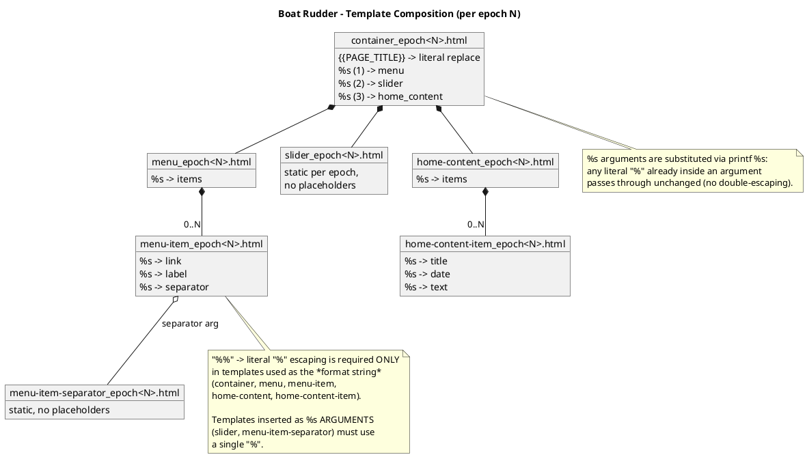
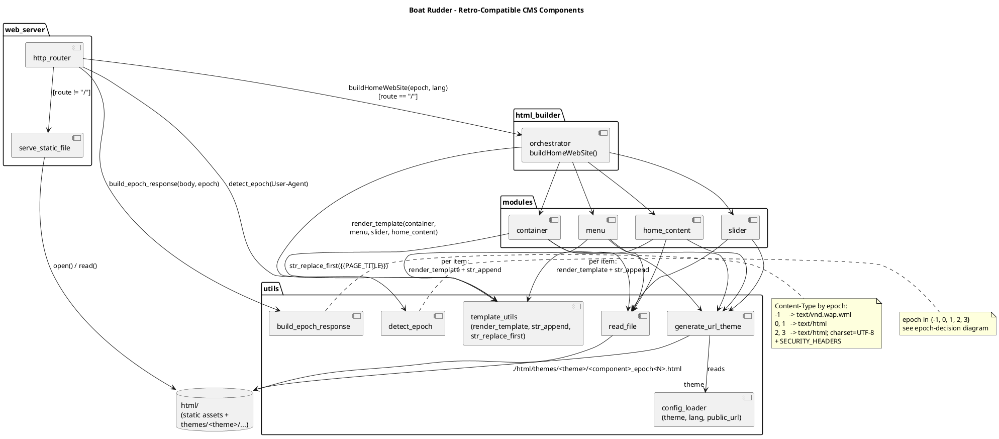
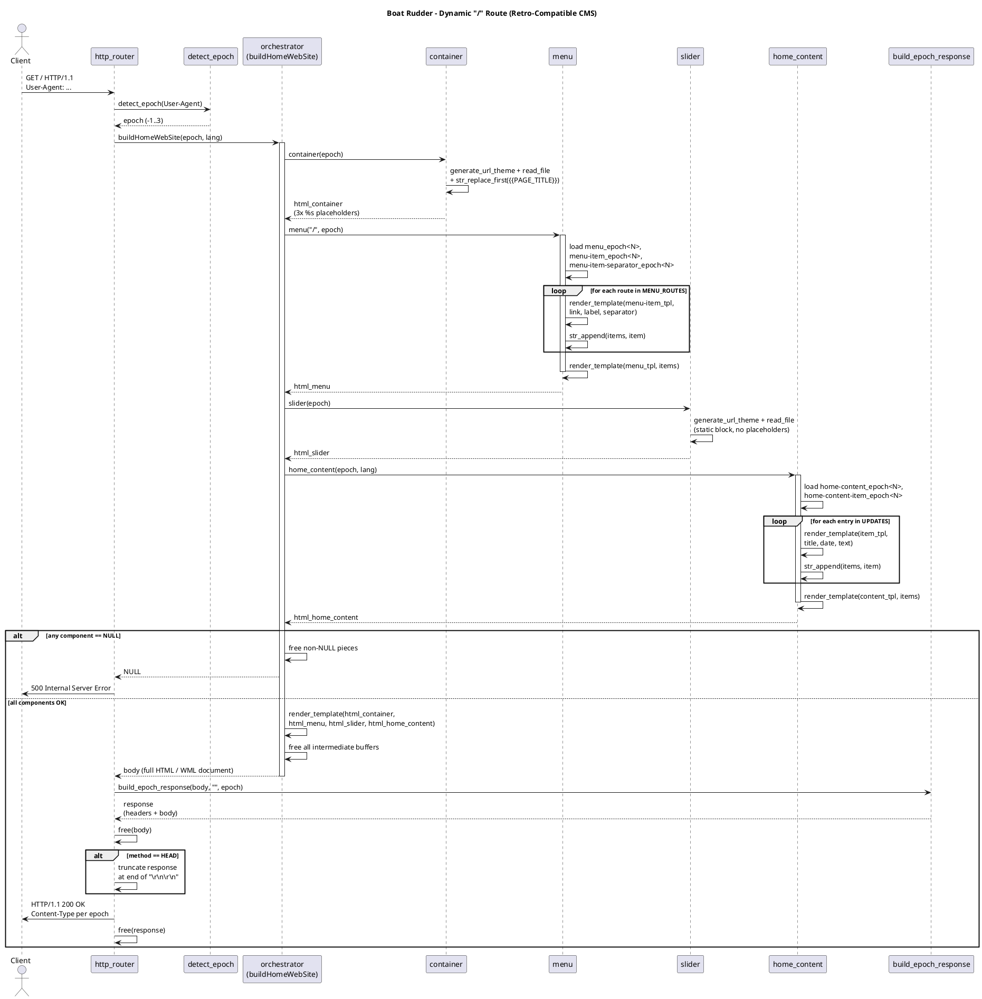

# Boat Rudder

**Boat Rudder** is a self-contained HTTP/HTTPS server, written in **C17**, that doubles as a
**retro-compatible CMS**: every request to `/` is rendered on the fly into the simplest markup
the requesting browser can understand - from 1999-era WAP phones to modern HTML5/CSS3 browsers -
while every other path (`/themes/...`, `/assets/...`, `/favicon.ico`, ...) is served as a
plain static file.

This document is a high-level tour of the whole project: the web server foundation, the
retro-compatible CMS concept, the **epoch** strategy that drives it, and the request lifecycle,
illustrated with diagrams. For deeper detail see:

- [architecture.md](architecture.md) - full component breakdown of the server.
- [data-flow.md](data-flow.md) - step-by-step data flow, including the dynamic `/` route.
- [retro-compatible-cms.md](retro-compatible-cms.md) - the original implementation plan (in
  Spanish) that this CMS was built from.
- [scripts.md](scripts.md) - build, run and deployment scripts (`bhs.sh`).
- [diagrams/](diagrams/) - PlantUML source files for every diagram in this document.

---

## 1. The Big Picture

```
                 ┌─────────────────────────────────────────────┐
                 │              base-http-server               │
                 │   (C17, OpenSSL, pthreads, select() loop)   │
                 └──────────────────────┬──────────────────────┘
                                        │
                        GET/HEAD <route>│
                                        ▼
                          ┌────────────────────────────┐
                          │        http_router         │
                          └──────┬───────────────┬─────┘
                       route=="/"│               │ route != "/"
                                 ▼               ▼
                  ┌─────────────────────────┐ ┌────────────────────────┐
                  │  Retro-Compatible CMS   │ │   serve_static_file()  │
                  │  (epoch-aware home page)│ │   from ./html/         │
                  └─────────────────────────┘ └────────────────────────┘
```

Two halves of the same binary, sharing the same connection-handling, TLS, security headers and
logging infrastructure:

1. **The web server** - a generic, hardened static file server (sockets, TLS, rate limiting,
   MIME types, caching headers).
2. **The CMS** - a small templating engine that assembles `/` from epoch-specific HTML/WML
   fragments based on the client's `User-Agent`.

---

## 2. The Retro-Compatible CMS Concept

### 2.1 Why "retro-compatible"?

The web has accumulated 30+ years of browsers with wildly different capabilities: WAP phones
that only understand WML, text browsers like Lynx, browsers from the mid-90s with no CSS or JS,
late-90s/2000s browsers with basic CSS1, and today's HTML5/CSS3/JS browsers.

Instead of sending one "lowest common denominator" page to everyone (or breaking on old
browsers), Boat Rudder classifies every incoming request into an **epoch** and serves a page
built specifically for that epoch's capabilities - same content, different markup.

### 2.2 The five epochs

`src/utils/detect_epoch.c` inspects the `User-Agent` header and classifies it into one of five
epochs:

| Epoch | Constant | Era / target browsers | `Content-Type` | Markup style |
|---|---|---|---|---|
| `-1` | `EPOCH_WML` | WAP 1.x phones (Nokia WAP, UP.Browser) | `text/vnd.wap.wml` | WML `<card>` deck, no HTML, text + `<a>` links only |
| `0` | `EPOCH_PRESTANDARD` | Text browsers (Lynx, Cello, Line Mode Browser) | `text/html` | Bare `<html>`, no styling attributes, `<h1>/<h2>/<hr>/<a>` only |
| `1` | `EPOCH_EARLY` | Mosaic, Netscape 1-2, MSIE ≤ 4 | `text/html` | HTML 3.2, `<table>` layout, `<font>`, `bgcolor`, no CSS/JS |
| `2` | `EPOCH_MIDDLE` | Netscape 4, MSIE 5-8, early Firefox/Chrome | `text/html; charset=UTF-8` | HTML4 + CSS1 (`styles_epoch2.css`), simple classes |
| `3` | `EPOCH_MODERN` | Current browsers | `text/html; charset=UTF-8` | HTML5 + CSS3 (`styles_epoch3.css`), responsive |

Classification is a simple, dependency-free substring/version heuristic over `User-Agent`, with
epoch `1` as the fallback for anything unrecognized (better to render an old-but-working page
than to assume modern capabilities).


> Source: [diagrams/epoch-decision.puml](diagrams/epoch-decision.puml)

### 2.3 Templates: one file per component, per epoch

Every visual building block of the home page lives under
`html/themes/<theme>/<component>/` as a set of files named
`<component>_epoch<N>.html` (`N` ∈ `{-1, 0, 1, 2, 3}`):

```
html/themes/dark/
├── styles_epoch2.css
├── styles_epoch3.css
├── container/
│   ├── container_epoch-1.html   (WML)
│   ├── container_epoch0.html    (plain text)
│   ├── container_epoch1.html    (tables + <font>)
│   ├── container_epoch2.html    (HTML4 + CSS1)
│   └── container_epoch3.html    (HTML5 + CSS3)
├── menu/
│   ├── menu_epoch{-1,0,1,2,3}.html
│   ├── menu-item_epoch{-1,0,1,2,3}.html
│   └── menu-item-separator_epoch{-1,0,1,2,3}.html
├── slider/
│   └── slider_epoch{-1,0,1,2,3}.html
└── home-content/
    ├── home-content_epoch{-1,0,1,2,3}.html
    └── home-content-item_epoch{-1,0,1,2,3}.html
```

Adding a new theme means adding a new `html/themes/<name>/` tree with the same file layout and
pointing `theme=<name>` in `configs/config.txt`.

### 2.4 Two kinds of placeholders

- **`{{PAGE_TITLE}}`** - resolved with a literal substring replace (`str_replace_first`). Used
  for things that should never collide with `printf` formatting (page titles, etc.).
- **`%s`** - positional placeholders resolved with `printf`-family formatting
  (`render_template`, a `vsnprintf` wrapper). The number and order of `%s` in every
  epoch variant of a given template **must match exactly**, so the C code that fills them in is
  epoch-agnostic.

Because templates double as `printf` format strings, a literal `%` must be written as `%%` -
**but only in templates that are themselves used as a format string**. Templates that are only
ever inserted *as an argument* into another template's `%s` (e.g. `slider_epoch<N>.html`,
`menu-item-separator_epoch<N>.html`) must use a single `%`, since `vsnprintf` does not
re-interpret `%s` argument contents.



> Source: [diagrams/template-composition.puml](diagrams/template-composition.puml)

### 2.5 Modules and the orchestrator

Four small C modules each load their own templates and return a fully-rendered HTML/WML
fragment for a given epoch:

| Module | Signature | Responsibility |
|---|---|---|
| `modules/container` | `char *container(int epoch)` | Page shell (`<head>`/`<body>` wrapper), resolves `{{PAGE_TITLE}}`, exposes 3 `%s` slots (menu, slider, home content) |
| `modules/menu` | `char *menu(const char *current_url, int epoch)` | Renders the navigation bar from a static `MENU_ROUTES[]` table, joining items with the epoch's separator |
| `modules/slider` | `char *slider(int epoch)` | Hero/banner block, static per epoch |
| `modules/home_content` | `char *home_content(int epoch, const char *lang)` | Welcome text + a static "updates" list, one item per `home-content-item_epoch<N>.html` |

`src/html_builder/orchestrator.c` ties them together:

```c
char *buildHomeWebSite(int epoch, const char *lang);
```

1. Calls `container`, `menu`, `slider`, `home_content` for the given epoch.
2. If any of the four returns `NULL`, frees whatever succeeded and returns `NULL` (the router
   answers `500`).
3. Otherwise calls `render_template(html_container, html_menu, html_slider, html_home_content)`
   to inject the three components into the container's `%s` slots.
4. Frees every intermediate buffer and returns the final page body.

Every function in this pipeline returns a `malloc`'d `char*` (or `NULL`); the caller is always
responsible for freeing it. This discipline is verified with AddressSanitizer in debug builds.



> Source: [diagrams/cms-components.puml](diagrams/cms-components.puml)

### 2.6 Wrapping the response

`src/utils/build_epoch_response.c` takes the assembled body and the detected epoch and produces
a complete HTTP response (status line, `Content-Type` per the table in §2.2, security headers,
`Content-Length`, body), reusing the same `SECURITY_HEADERS` pattern as the static file server
(`X-Content-Type-Options: nosniff`, `X-Frame-Options: SAMEORIGIN`).

---

## 3. The Web Server

The CMS sits on top of a generic, dependency-light static file server:

- **Language/standard**: C17, built with CMake. Only external dependency: OpenSSL.
- **Concurrency**: one main thread runs a `select()`-based accept loop; each accepted
  connection is handled by a **detached pthread**.
- **Limits**: a global cap of 200 concurrent connections and per-IP rate limiting (500
  requests / 5 s) with LRU eviction of stale IP entries.
- **TLS**: optional HTTPS socket, TLS 1.2 minimum, hardened cipher suites
  (ECDHE+AESGCM/ChaCha20).
- **I/O abstraction**: `connection.c` provides `connection_write` / `plain_read` / `ssl_read` /
  `connection_close`, so the rest of the code is protocol-agnostic.
- **Routing** (`http_router.c`):
  - `GET`/`HEAD /` → the dynamic CMS pipeline described in §2.
  - `GET`/`HEAD <anything else>` → `serve_static_file()` against the `html/` root, with
    `Last-Modified` / `If-Modified-Since` cache validation, MIME type detection and 8 KiB
    streaming.
  - `OPTIONS` → `204` with `Allow: GET, HEAD, OPTIONS`.
  - any other method → `405 Method Not Allowed`.
- **Security**: directory traversal protection (`sanitize_path` + `realpath`), trusted-proxy-only
  `X-Real-IP`/`X-Forwarded-For` handling, capped header/body sizes (`431`/`413` on overflow),
  `SIGPIPE` suppression.

For the full breakdown (every source file and its responsibility), see
[architecture.md](architecture.md).

---

## 4. Request Lifecycle for `GET /`



> Source: [diagrams/sequence-home-route.puml](diagrams/sequence-home-route.puml)

In short:

1. The client connects and sends `GET / HTTP/1.1` with a `User-Agent` header.
2. `http_router` resolves the epoch: if `force_epoch` in `configs/config.txt` is set to a value
   in `{-1, 0, 1, 2, 3}`, that value is used directly; otherwise `detect_epoch(User-Agent)`
   classifies the request into one of those epochs.
3. `buildHomeWebSite(epoch, lang)` assembles the page from `container` + `menu` + `slider` +
   `home_content`, all resolved via `generate_url_theme()` against
   `./html/themes/<theme>/...`.
4. `build_epoch_response(body, "", epoch)` wraps the body with the correct `Content-Type` and
   security headers.
5. For `HEAD /`, the response is truncated right after the header block (`\r\n\r\n`) before being
   written to the socket.
6. All intermediate buffers are freed on every path, including the error paths (`500` if any
   module returns `NULL`).

Every other route (`/themes/dark/styles_epoch3.css`, `/favicon.ico`,
`/assets/slide/background/floor.jpg`, ...) bypasses the CMS entirely and is served directly from
`html/` by the existing static file server, with normal caching headers.

---

## 5. Configuration

`configs/config.txt` controls both the server and the CMS:

```ini
verbose_level=3           # 0=none 1=error 2=warn 3=info 4=debug
http_port=8080
https_port=8443
ssl_enabled=0             # 1 to enable HTTPS
ssl_cert=./ssl/cert.pem
ssl_key=./ssl/key.pem
trusted_proxies=          # comma-separated IPs of trusted reverse proxies

theme=dark                 # active theme under html/themes/<theme>/
lang=Eng                   # content language passed to home_content
public_url=                # public base URL (reserved for future SEO/canonical links)
#force_epoch=3             # force a browser epoch for "/" (-1..3), omit to auto-detect
```

`generate_url_theme()` always resolves templates as `./html/themes/<theme>/...`, relative to the
server's working directory - independent of the `<root_directory>` argument used for static
file serving (which also points at `html/`).

---

## 6. Building and Running

```bash
./bhs.sh compiledebug      # Debug build + AddressSanitizer, assembled into bin/
./bhs.sh rundebug           # Run bin/base-http-server -c bin/configs/config.txt bin/html
```

See [scripts.md](scripts.md) for the full `bhs.sh` reference (production builds, systemd
install, TLS certificate generation).

---

## 7. Roadmap (not yet implemented)

The current implementation is an MVP covering only the home page. Planned next steps (see
[retro-compatible-cms.md §9](retro-compatible-cms.md)):

- Theme (`light`) and language (`Esp`) switching via query string / cookie.
- Additional pages (`/blog`, `/about`, ...) reusing `container`/`menu`.
- A real content source for `home_content` (Markdown/JSON files or a small database) instead of
  the static `UPDATES[]` array.
- SEO metadata (Open Graph, JSON-LD) for epoch 3.

---

## Contact

For contact or more information:

**Jonathan Pablo Toledo Moya**
theretrocenter.com@gmail.com
