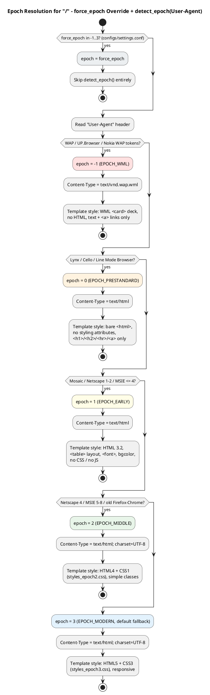
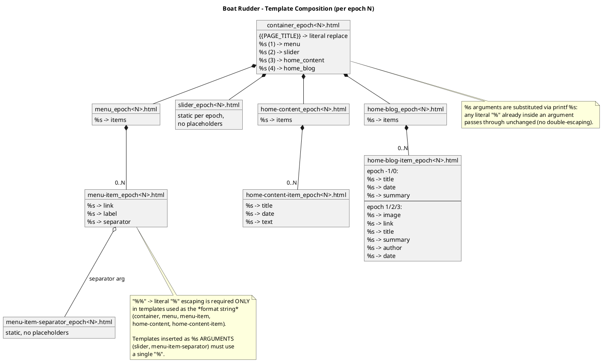
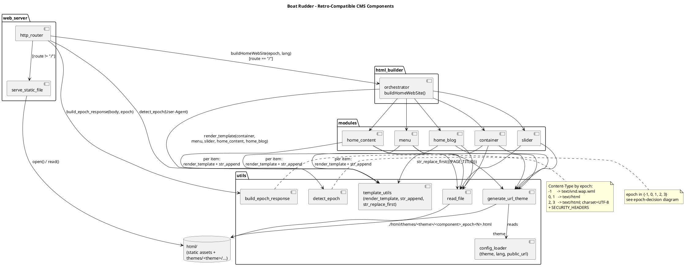
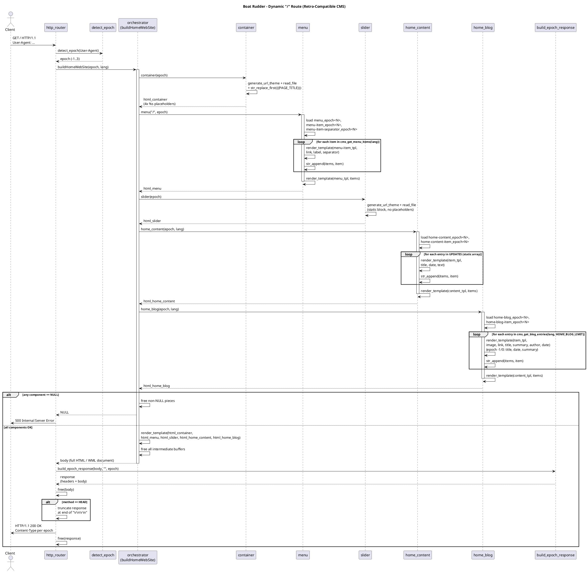
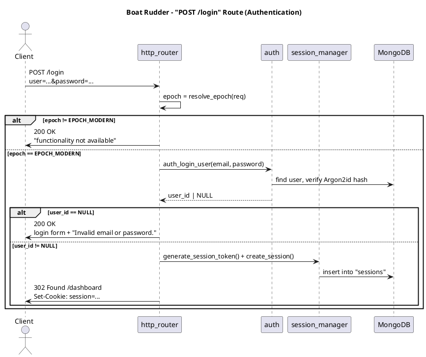

# Boat Rudder

**Boat Rudder** is a self-contained HTTP/HTTPS server, written in **C17**, that doubles as a
**retro-compatible CMS**: every request to `/` is rendered on the fly into the simplest markup
the requesting browser can understand - from 1999-era WAP phones to modern HTML5/CSS3 browsers -
while every other path (`/themes/...`, `/assets/...`, `/favicon.ico`, ...) is served as a
plain static file.

Boat Rudder grew out of `base-http-server`, a minimal standalone static file server; that
ancestry survives only as the shape of the web-server half. Everything in this repository - the
`boat-rudder` binary and systemd service, the source tree, the `boat-rudder__*` CSS namespace -
is Boat Rudder. A **site** built with it (its MongoDB database, its theme, its content) is a
separate concern that never appears in the source: the site name, banner and page titles a
visitor reads are content, and the templates ship "Boat Rudder" only as the default until a site
overrides it.

This document is a high-level tour of the whole project: the web server foundation, the
retro-compatible CMS concept, the **epoch** strategy that drives it, and the request lifecycle,
illustrated with diagrams. For deeper detail see:

- [reference/architecture.md](reference/architecture.md) - the server foundation, plus a map of
  every other document.
- [reference/rendering.md](reference/rendering.md) - epochs, templates and every public page.
- [reference/dashboard.md](reference/dashboard.md) - login, sessions, roles and the maintainers.
- [reference/entry-editor.md](reference/entry-editor.md) - the `/dashboard/entries/<id>/edit` AJAX content editor.
- [reference/media-admin.md](reference/media-admin.md) - the `/dashboard/media` media library.
- [reference/configuration.md](reference/configuration.md) - every `configs/settings.conf` key.
- [reference/data-flow.md](reference/data-flow.md) - step-by-step data flow, including the dynamic `/` route.
- [reference/scripts.md](reference/scripts.md) - build, run and deployment scripts (`boat_rudder_builder.sh`).
- [reference/style-guide.md](reference/style-guide.md) - C conventions and security rules.
- [plans/](plans/) - per-feature implementation plans.
- [diagrams/](diagrams/) - PlantUML source files for every diagram in this document.

---

## 1. The Big Picture

```
                 ┌─────────────────────────────────────────────┐
                 │                 boat-rudder                 │
                 │   (C17, OpenSSL, pthreads, select() loop)   │
                 └──────────────────────┬──────────────────────┘
                                        │
                        GET/HEAD <route>│
                                        ▼
                          ┌────────────────────────────┐
                          │        http_router         │
                          └──────┬───────────────┬─────┘
                       route=="/"│               │ route != "/"
                                 ▼               ▼
                  ┌─────────────────────────┐ ┌────────────────────────┐
                  │  Retro-Compatible CMS   │ │   serve_static_file()  │
                  │  (epoch-aware home page)│ │   from ./html/         │
                  └─────────────────────────┘ └────────────────────────┘
```

Two halves of the same binary, sharing the same connection-handling, TLS, security headers and
logging infrastructure:

1. **The web server** - a generic, hardened static file server (sockets, TLS, rate limiting,
   MIME types, caching headers).
2. **The CMS** - a small templating engine that assembles `/` from epoch-specific HTML/WML
   fragments based on the client's `User-Agent`.

---

## 2. The Retro-Compatible CMS Concept

### 2.1 Why "retro-compatible"?

The web has accumulated 30+ years of browsers with wildly different capabilities: WAP phones
that only understand WML, text browsers like Lynx, browsers from the mid-90s with no CSS or JS,
late-90s/2000s browsers with basic CSS1, and today's HTML5/CSS3/JS browsers.

Instead of sending one "lowest common denominator" page to everyone (or breaking on old
browsers), Boat Rudder classifies every incoming request into an **epoch** and serves a page
built specifically for that epoch's capabilities - same content, different markup.

### 2.2 The five epochs

`src/utils/detect_epoch.c` inspects the `User-Agent` header and classifies it into one of five
epochs:

| Epoch | Constant | Era / target browsers | `Content-Type` | Markup style |
|---|---|---|---|---|
| `-1` | `EPOCH_WML` | WAP 1.x phones (Nokia WAP, UP.Browser) | `text/vnd.wap.wml` | WML `<card>` deck, no HTML, text + `<a>` links only |
| `0` | `EPOCH_PRESTANDARD` | Text browsers (Lynx, Cello, Line Mode Browser) | `text/html` | Bare `<html>`, no styling attributes, `<h1>/<h2>/<hr>/<a>` only |
| `1` | `EPOCH_EARLY` | Mosaic, Netscape 1-2, MSIE ≤ 4 | `text/html` | HTML 3.2, `<table>` layout, `<font>`, `bgcolor`, no CSS/JS |
| `2` | `EPOCH_MIDDLE` | Netscape 4, MSIE 5-8, early Firefox/Chrome | `text/html; charset=UTF-8` | HTML4 + CSS1 (`styles_epoch2.css`), simple classes |
| `3` | `EPOCH_MODERN` | Current browsers | `text/html; charset=UTF-8` | HTML5 + CSS3 (`styles_epoch3.css`), responsive |

Classification is a simple, dependency-free substring/version heuristic over `User-Agent`, with
epoch `1` as the fallback for anything unrecognized (better to render an old-but-working page
than to assume modern capabilities).

> **Login is `EPOCH_MODERN`-only.** For security reasons, the `/login` form (and all
> credential handling) is only served to `EPOCH_MODERN` (epoch `3`) clients - enforced
> server-side on both `GET` and `POST /login`. The other four epochs show a static
> "this functionality is not available" message instead. See
> [§5, Authentication](#5-authentication-login-dashboard-and-logout).



> Source: [diagrams/epoch-decision.puml](diagrams/epoch-decision.puml)

### 2.3 Templates: one file per component, per epoch

Every visual building block of the home page lives under
`html/themes/<theme>/<component>/` as a set of files named
`<component>_epoch<N>.html` (`N` ∈ `{-1, 0, 1, 2, 3}`):

```
html/themes/dark/
├── styles_epoch2.css
├── styles_epoch3.css
├── container/
│   ├── container_epoch-1.html   (WML)
│   ├── container_epoch0.html    (plain text)
│   ├── container_epoch1.html    (tables + <font>)
│   ├── container_epoch2.html    (HTML4 + CSS1)
│   └── container_epoch3.html    (HTML5 + CSS3)
├── menu/
│   ├── menu_epoch{-1,0,1,2,3}.html
│   ├── menu-item_epoch{-1,0,1,2,3}.html
│   └── menu-item-separator_epoch{-1,0,1,2,3}.html
├── slider/
│   └── slider_epoch{-1,0,1,2,3}.html
├── home-content/
│   ├── home-content_epoch{-1,0,1,2,3}.html
│   └── home-content-item_epoch{-1,0,1,2,3}.html
├── home-blog/
│   ├── home-blog_epoch{-1,0,1,2,3}.html
│   └── home-blog-item_epoch{-1,0,1,2,3}.html
├── category-menu/
│   └── category-menu{,-item,-item-selected}_epoch{-1,0,1,2,3}.html
├── elements/<block-type>/          (one dir per content block type)
└── dashboard/                       (admin pages, epoch 3 only)
```

The tree above shows the home page's components; the full set also covers the page shell
(`page/`), the blog listing (`blog-list/`), CMS entries (`entry/`), content blocks
(`elements/`), errors (`error/`) and the dashboard. See
[reference/rendering.md](reference/rendering.md) for the complete inventory.

Adding a new theme means adding a new `html/themes/<name>/` tree with the same file layout and
pointing `theme=<name>` in `configs/settings.conf`.

### 2.4 Two kinds of placeholders

- **`{{PAGE_TITLE}}`** - resolved with a literal substring replace (`str_replace_first`). Used
  for things that should never collide with `printf` formatting (page titles, etc.).
- **`%s`** - positional placeholders resolved with `printf`-family formatting
  (`render_template`, a `vsnprintf` wrapper). The number and order of `%s` in every
  epoch variant of a given template **must match exactly**, so the C code that fills them in is
  epoch-agnostic.

Because templates double as `printf` format strings, a literal `%` must be written as `%%` -
**but only in templates that are themselves used as a format string**. Templates that are only
ever inserted *as an argument* into another template's `%s` (e.g. `slider_epoch<N>.html`,
`menu-item-separator_epoch<N>.html`) must use a single `%`, since `vsnprintf` does not
re-interpret `%s` argument contents.



> Source: [diagrams/template-composition.puml](diagrams/template-composition.puml)

### 2.5 Modules and the orchestrator

Five small C modules each load their own templates and return a fully-rendered HTML/WML
fragment for a given epoch:

| Module | Signature | Responsibility |
|---|---|---|
| `modules/container` | `char *container(int epoch)` | Page shell (`<head>`/`<body>` wrapper), resolves `{{PAGE_TITLE}}`, exposes 4 `%s` slots (menu, slider, home content, home blog) |
| `modules/menu` | `char *menu(const char *current_url, int epoch)` | Renders the navigation bar from the `menu` collection (`cms_get_menu_items()`), joining items with the epoch's separator and marking the item matching `current_url`; falls back to a single built-in `{"/", "Home"}` item if the query returns nothing |
| `modules/slider` | `char *slider(int epoch)` | Hero/banner (mainbanner) block, static per epoch |
| `modules/home_content` | `char *home_content(int epoch, const char *lang)` | Welcome text + an "updates" list from the static `UPDATES[]` array - the last hard-coded content source left (see §9) |
| `modules/home_blog` | `char *home_blog(int epoch, const char *lang)` | "Latest Blog Posts" gallery, one item per `home-blog-item_epoch<N>.html`, from the `entries` collection (`cms_get_blog_entries()`, `type: "blog"`, newest first, capped at `HOME_BLOG_LIMIT`) |

`src/html_builder/orchestrator.c` ties them together:

```c
char *buildHomeWebSite(int epoch, const char *lang);
```

1. Calls `container`, `menu`, `slider`, `home_content`, `home_blog` for the given epoch.
2. If any of the five returns `NULL`, frees whatever succeeded and returns `NULL` (the router
   answers `500`).
3. Otherwise calls
   `render_template(html_container, html_menu, html_slider, html_home_content, html_home_blog)`
   to inject the four components into the container's `%s` slots.
4. Frees every intermediate buffer and returns the final page body.

Every function in this pipeline returns a `malloc`'d `char*` (or `NULL`); the caller is always
responsible for freeing it. This discipline is verified with AddressSanitizer in debug builds.



> Source: [diagrams/cms-components.puml](diagrams/cms-components.puml)

### 2.6 Wrapping the response

`src/utils/build_epoch_response.c` takes the assembled body and the detected epoch and produces
a complete HTTP response (status line, `Content-Type` per the table in §2.2, security headers,
`Content-Length`, body), reusing the same `SECURITY_HEADERS` pattern as the static file server
(`X-Content-Type-Options: nosniff`, `X-Frame-Options: SAMEORIGIN`).

---

## 3. The Web Server

The CMS sits on top of a generic, dependency-light static file server:

- **Language/standard**: C17, built with CMake. External dependencies: OpenSSL for the server
  itself, plus libmongoc and libsodium for the database-backed CMS and the dashboard.
- **Concurrency**: one main thread runs a `select()`-based accept loop; each accepted
  connection is handled by a **detached pthread**.
- **Limits**: a global cap of 200 concurrent connections and per-IP rate limiting (500
  requests / 5 s) with LRU eviction of stale IP entries.
- **TLS**: optional HTTPS socket, TLS 1.2 minimum, hardened cipher suites
  (ECDHE+AESGCM/ChaCha20).
- **I/O abstraction**: `connection.c` provides `connection_write` / `plain_read` / `ssl_read` /
  `connection_close`, so the rest of the code is protocol-agnostic.
- **Routing** (`http_router.c`):
  - `GET`/`HEAD /` → the dynamic CMS pipeline described in §2.
  - `GET`/`HEAD /login` → if a valid session cookie is present, `302 /dashboard`; otherwise the
    login form (epoch3) or "not available" message (other epochs).
  - `GET`/`HEAD /dashboard` → the admin home (entries listing, plus the Categories / Languages /
    Menu / Users links for an Administrador) if a valid session cookie is present, otherwise
    `302 /login`.
  - `GET`/`HEAD /logout` → destroys the session (if any) and `302 /` with a cleared cookie.
  - `GET`/`HEAD /blog`, `/blog/category/<slug>`, `/blog/<link>`, `/page/<link>`, `/gallery/<id>`
    → the database-backed CMS pages (see §8 and
    [reference/rendering.md](reference/rendering.md)).
  - `GET`/`POST /dashboard/...` → the admin area: entries listing and editor, media library,
    Categories, Languages, Menu and Users maintainers (see
    [reference/dashboard.md](reference/dashboard.md)).
  - `POST /login` → `EPOCH_MODERN` only; verifies credentials against MongoDB and on success
    sets a session cookie and redirects to `/dashboard`. See §5.
  - `GET`/`HEAD <anything else>` → `serve_static_file()` against the `html/` root, with
    `Last-Modified` / `If-Modified-Since` cache validation, MIME type detection and 8 KiB
    streaming.
  - `OPTIONS` → `204` with `Allow: GET, HEAD, OPTIONS, POST`.
  - any other method → `405 Method Not Allowed`.
  - Every non-2xx/3xx response (`400`, `403`, `404`, `405`, `431`, `500`, `503`) is rendered
    through the same centralized, epoch-aware `error_epoch<N>.html` template - see §5.4.
- **Security**: directory traversal protection (`sanitize_path` + `realpath`), trusted-proxy-only
  `X-Real-IP`/`X-Forwarded-For` handling, capped header/body sizes (`431`/`413` on overflow),
  `SIGPIPE` suppression.

For the full breakdown (every source file and its responsibility), see
[reference/architecture.md](reference/architecture.md).

---

## 4. Request Lifecycle for `GET /`



> Source: [diagrams/sequence-home-route.puml](diagrams/sequence-home-route.puml)

In short:

1. The client connects and sends `GET / HTTP/1.1` with a `User-Agent` header.
2. `http_router` resolves the epoch: if `force_epoch` in `configs/settings.conf` is set to a value
   in `{-1, 0, 1, 2, 3}`, that value is used directly; otherwise `detect_epoch(User-Agent)`
   classifies the request into one of those epochs.
3. `buildHomeWebSite(epoch, lang)` assembles the page from `container` + `menu` + `slider` +
   `home_content` + `home_blog`, all resolved via `generate_url_theme()` against
   `./html/themes/<theme>/...`.
4. `build_epoch_response(body, "", epoch)` wraps the body with the correct `Content-Type` and
   security headers.
5. For `HEAD /`, the response is truncated right after the header block (`\r\n\r\n`) before being
   written to the socket.
6. All intermediate buffers are freed on every path, including the error paths (`500` if any
   module returns `NULL`).

Every other route (`/themes/dark/styles_epoch3.css`, `/favicon.ico`,
`/assets/slide/background/floor.jpg`, ...) bypasses the CMS entirely and is served directly from
`html/` by the existing static file server, with normal caching headers.

---

## 5. Authentication: Login, Dashboard and Logout

A small authentication slice sits alongside the CMS, reusing the same epoch detection,
templates and `build_epoch_response` infrastructure via a new generic page shell.

### 5.1 A page shell for non-home routes

`/login`, `/dashboard` and every error page share `page_epoch<N>.html` (head + menu + footer,
1 `%s` for the menu and 1 `%s` for the page content), assembled by:

```c
char *buildPageWebSite(int epoch, const char *page_title, char *html_content);
```

This mirrors `buildHomeWebSite()` but for a single content fragment instead of the four
home-page components - `/` keeps using `container_epoch<N>.html` and `buildHomeWebSite()`
unchanged.

### 5.2 Data layer: MongoDB, Argon2id, sessions

A new `src/db/` layer (`mongodb_manager`, `auth`, `session_manager`) backs `/login` and
`/dashboard`:

- **`mongodb_manager`** owns a `mongoc_client_pool_t` (configured via `mongodb_uri`/
  `mongodb_db`), initialized once at startup. If it fails to connect, the server keeps running
  - only `/login` and `/dashboard` degrade to a `503` error page.
- **`auth_login_user(email, password)`** checks the `users` collection and verifies the
  password against a `crypto_pwhash_str()` (Argon2id) hash via libsodium. It returns `NULL` for
  an unknown email, a wrong password, *and* a DB error alike, so the response can never be used
  to enumerate registered emails.
- **`session_manager`** generates 64-hex-char session tokens (libsodium CSPRNG), stores them in
  the `sessions` collection with an `expires_at` (`session_ttl_seconds`, default 24h), and
  builds the `Set-Cookie` headers (`HttpOnly; Path=/; SameSite=Lax`, `; Secure` when
  `ssl_enabled=1`).

> Source: [diagrams/auth-components.puml](diagrams/auth-components.puml) - component diagram
> for `login`/`dashboard`/`error` and the `db` package.

### 5.3 `POST /login` → session → `/dashboard`



> Source: [diagrams/sequence-login-route.puml](diagrams/sequence-login-route.puml)

The full request table:

| Route | Method | Behavior |
|---|---|---|
| `/login` | `GET` | If `mongodb_manager_is_ready()` and the session cookie is valid → `302 /dashboard`. Otherwise `login(epoch, NULL)` via `buildPageWebSite()`. `EPOCH_MODERN`: real form. Other epochs: "not available". |
| `/login` | `POST` | `EPOCH_MODERN` only (other epochs re-render "not available", no DB access). `503` if MongoDB isn't ready. Otherwise `auth_login_user()` → success: new session + `Set-Cookie` + `302 /dashboard`; failure: `200` with the form + "Invalid email or password." |
| `/dashboard` | `GET` | `503` if MongoDB isn't ready. Otherwise `validate_session_cookie()`: valid → `dashboard(epoch)` via `buildPageWebSite()`; invalid/missing/expired → `302 /login`. |
| `/logout` | `GET` | Destroys the session (if any) and responds `302 /` with a cleared `session` cookie (`Max-Age=0`). |

### 5.4 Centralized epoch-aware error pages

Every non-2xx/3xx response - `400`, `403`, `404`, `405`, `431`, `500`, `503`, including those
from `serve_static_file()` - is rendered through one helper:

```c
send_error_response(ctx, status_code, status_line, epoch);
```

which calls `error_content(epoch, status_code, NULL)` (`src/modules/error`,
`error_epoch<N>.html`), wraps it with `buildPageWebSite()`, and sends it via
`build_epoch_response_status()`. `serve_static_file()` itself returns a status code (`0`,
`403`, `404` or `500`) instead of writing a hardcoded response, letting `http_router.c` render
even missing-asset 404s in the visitor's epoch. If template rendering itself fails,
`send_error_response()` falls back to a hardcoded minimal HTML response.

---

## 6. Configuration

`configs/settings.conf` controls both the server and the CMS. Every key - ports, TLS, trusted
proxies, `theme`, the `lang` fallback, `force_epoch`, the MongoDB connection and the session TTL
- is documented once in **[reference/configuration.md](reference/configuration.md)**.

Three of them shape what this document describes:

- **`theme`** selects the template tree: every fragment resolves as
  `./html/themes/<theme>/...` through `generate_url_theme()`, relative to the server's working
  directory and independent of the `<root_directory>` argument used for static file serving
  (which also points at `html/`).
- **`force_epoch`** pins the epoch for every dynamic route instead of detecting it from
  `User-Agent` - the fastest way to inspect a retro layout from a modern browser (§2.2).
- **`lang`** is only a fallback. The real content language comes from the `languages`
  collection; `lang` is consulted when MongoDB is unavailable or no language is marked as
  default (§8).

---

## 7. Building and Running

```bash
./boat_rudder_builder.sh compiledebug      # Debug build + AddressSanitizer, assembled into bin/
./boat_rudder_builder.sh rundebug           # Run bin/boat-rudder -c ./configs/settings.conf ./html
```

See [reference/scripts.md](reference/scripts.md) for the full `boat_rudder_builder.sh` reference (production
builds, systemd install, TLS certificate generation).

---

## 8. Implemented since initial release

Features added after the initial home-page MVP:

- **CMS entries**: `/blog/<link>` and `/page/<link>` served from a MongoDB `entries` collection with a per-language `header` (image, title, summary, date) plus an `author_id` reference into `users`, and an ordered `content[]` array of typed blocks.
- **Blog listing** (`/blog`), **category-filtered listing** (`/blog/category/<slug>`) with a category bar under the navbar, and the home "Latest Blog Posts" section.
- **Content block types** (14): `tittle` (H1-H6), `paragraph` (rich text), `image`, `byline` and `gallery` on every epoch; `separator`, `link`, `list`, `table`, `code-text`, `youtube-embed`, `image-paragraph`, `social-networks` and `generic` on epoch 3 only.
- **Gallery**: epoch 3 CSS grid with lightbox (click to open, prev/next, ESC); epochs 1-2 paginated viewer; `/gallery/<id>` public route.
- **Media admin** (`/dashboard/media`): directory management, drag-and-drop upload, `scripts/image-optimizer.sh` (5 variants per image via ImageMagick), paginated grid, media picker modal for the entry editor.
- **Entry editor** (`/dashboard/entries/<id>/edit`): document-style editor UX with a fixed top bar, preview/edit toggle per block, rich-text for paragraphs, heading-level buttons for titles, gallery thumbnail drag-and-drop, drag-and-drop block reorder, publish/autosave toggles.
- **Authentication**: login (Argon2id via libsodium), session cookies, roles (Administrador / Autor).
- **Dashboard maintainers**: Categories, Languages, Menu, Users (with a display `name` used as the entry author).
- **Active menu item**: `--selected` CSS modifier on the nav item matching the current URL, and on the active category in the category bar.
- **Language admin**: `languages` collection drives content language; `/dashboard/languages` to add/remove/set default.
- **Multipart body reading**: router reads full POST body based on `Content-Length` (supports file uploads up to 10 MiB).

## 9. Roadmap (not yet implemented)

- **Site settings from MongoDB** (`site_settings` collection + `/dashboard/settings`): site name,
  banner, favicon, logo, brand colors and every page `<title>`, so nothing a visitor reads about
  the site's identity stays hardcoded in the source - see
  [plans/site-settings-plan.md](plans/site-settings-plan.md). This is the next planned increment.
- Theme (`light`) switching and per-visitor language selection via query string / cookie.
- A real content source for `home_content` (replacing the static `UPDATES[]` array).
- Older-epoch (-1..2) templates for the nine epoch-3-only content block types - they currently render as empty output on retro browsers.
- The `image-single` block type.
- Pagination for `/blog` and `/blog/category/<slug>` (both are capped at `BLOG_LIST_LIMIT`, currently 50).
- SEO metadata (Open Graph, JSON-LD) for epoch 3.
- QR code generation for gallery pages on epochs -1/0 (currently shows text links).
- Human-readable gallery URLs (`/gallery/<slug>`; today the route takes the `_id` hex only).

---

## Contact

For contact or more information:

**Jonathan Pablo Toledo Moya**
theretrocenter.com@gmail.com
