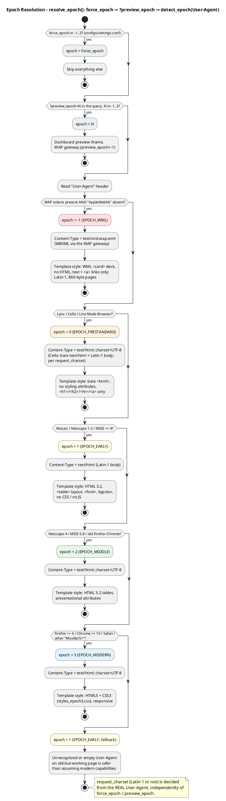
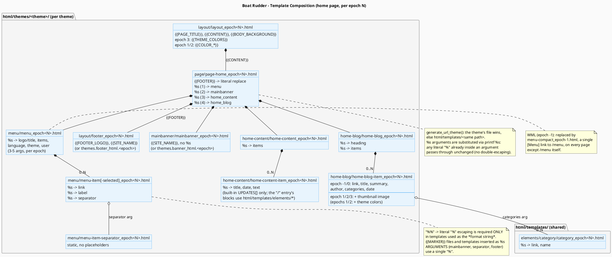
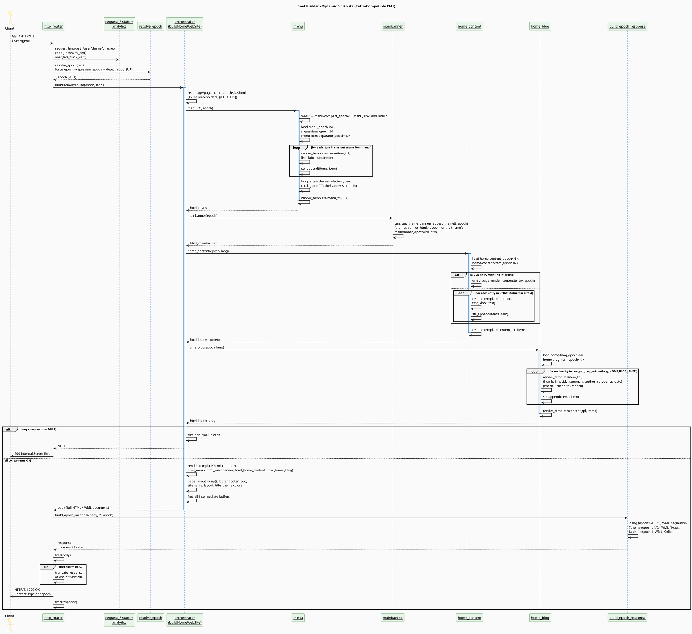
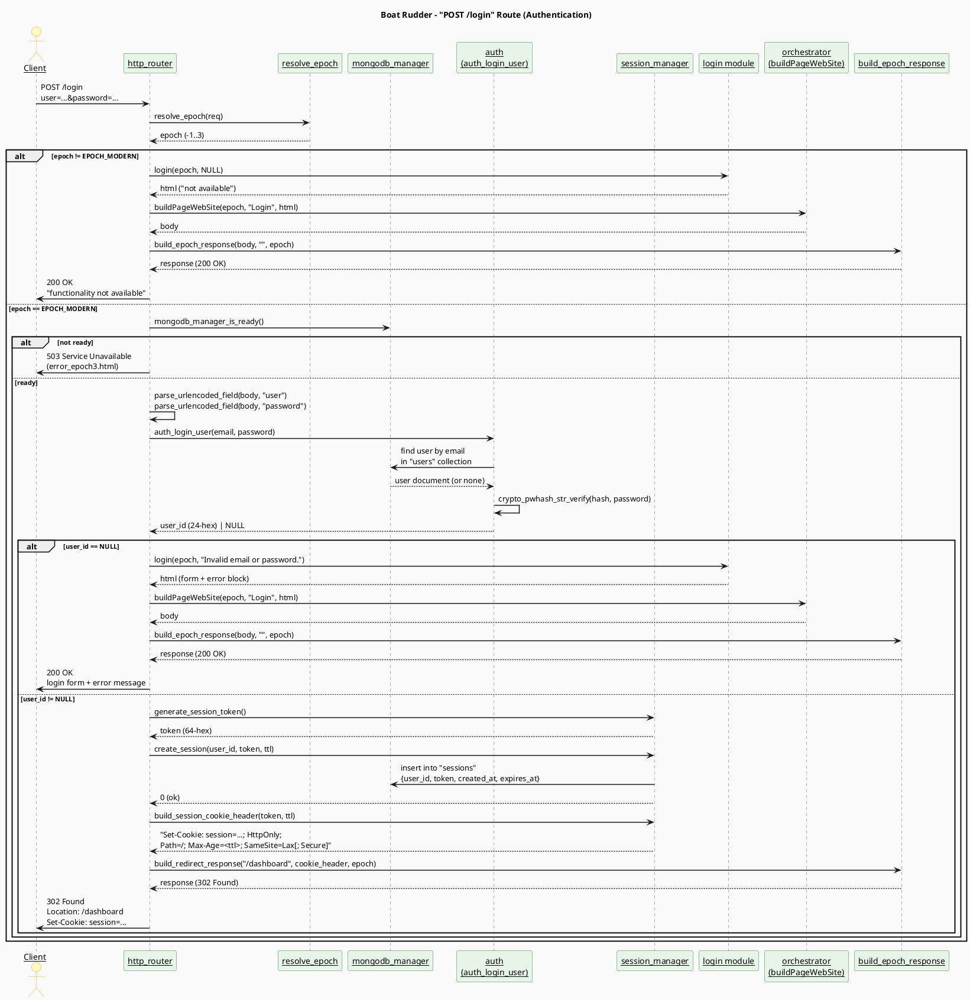

# Boat Rudder

**Boat Rudder** is a self-contained HTTP/HTTPS server, written in **C17**, that doubles as a
**retro-compatible CMS**: every dynamic page (`/`, `/blog`, `/page/<link>`, …) is rendered on
the fly into the simplest markup the requesting browser can understand - from 1999-era WAP phones
to modern HTML5/CSS3 browsers - while every other path (`/assets/...`, `/content/...`,
`/favicon.ico`, ...) is served as a plain static file. An optional built-in **WAP 1.x gateway**
lets real vintage phones reach the site over UDP, and a cookie-less **analytics** module counts
visits per epoch, browser, OS and country.

Boat Rudder grew out of `base-http-server`, a minimal standalone static file server; that
ancestry survives only as the shape of the web-server half. Everything in this repository - the
`boat-rudder` binary and systemd service, the source tree, the `boat-rudder-*` CSS namespace -
is Boat Rudder. A **site** built with it (its MongoDB database, its theme, its content) is a
separate concern that never appears in the source: the site name, banner and page titles a
visitor reads are content, and the templates ship "Boat Rudder" only as the default until a site
overrides it.

This document is a high-level tour of the whole project: the web server foundation, the
retro-compatible CMS concept, the **epoch** strategy that drives it, and the request lifecycle,
illustrated with diagrams. For deeper detail see:

- [reference/architecture.md](reference/architecture.md) - the server foundation, plus a map of
  every other document.
- [reference/rendering.md](reference/rendering.md) - epochs, templates, the response layer and every public page.
- [reference/routes.md](reference/routes.md) - every route, its guard and handler.
- [reference/data-model.md](reference/data-model.md) - every MongoDB collection.
- [reference/dashboard.md](reference/dashboard.md) - login, sessions, roles and the maintainers.
- [reference/entry-editor.md](reference/entry-editor.md) - the `/dashboard/entries/<id>/edit` AJAX content editor.
- [reference/media-admin.md](reference/media-admin.md) - the `/dashboard/media` media library.
- [reference/themes.md](reference/themes.md) and [reference/fonts.md](reference/fonts.md) - themes, site settings, font library.
- [reference/analytics.md](reference/analytics.md) - visit tracking, GeoIP and the report.
- [reference/wap-gateway.md](reference/wap-gateway.md) - the UDP WAP gateway and WBXML.
- [reference/qr-and-short-links.md](reference/qr-and-short-links.md), [reference/code-highlighting.md](reference/code-highlighting.md), [reference/templates-catalog.md](reference/templates-catalog.md).
- [reference/configuration.md](reference/configuration.md) - every `configs/settings.conf` key.
- [reference/security.md](reference/security.md) - every defense and the known gaps.
- [reference/data-flow.md](reference/data-flow.md) - step-by-step data flow, including the dynamic `/` route.
- [reference/scripts.md](reference/scripts.md) - build, run and deployment.
- [reference/third-party.md](reference/third-party.md) - vendored, ported and linked code.
- [reference/style-guide.md](reference/style-guide.md) - C conventions and security rules.
- [../CHANGELOG.md](../CHANGELOG.md) - what changed, by version.
- [plans/](plans/) - per-feature implementation plans.
- [diagrams/](diagrams/) - PlantUML source files for every diagram in this document.

---

## 1. The Big Picture

```
   WAP phone ──UDP──► wap_gateway ──loopback HTTP──┐
                                                    ▼
                 ┌─────────────────────────────────────────────┐
  browser ─TCP──►│                 boat-rudder                 │
                 │ (C17, OpenSSL, pthreads, anti-DDoS accept)  │
                 └──────────────────────┬──────────────────────┘
                                        │
                                        ▼
                          ┌────────────────────────────┐
                          │ http_router (+ analytics)  │
                          └──────┬───────────────┬─────┘
                  dynamic routes │               │ anything else
                                 ▼               ▼
                  ┌─────────────────────────┐ ┌────────────────────────┐
                  │  Retro-Compatible CMS   │ │   serve_static_file()  │
                  │  pages + /dashboard     │ │   from ./html/         │
                  └────────────┬────────────┘ └────────────────────────┘
                               ▼
                           MongoDB
```

Two halves of the same binary, sharing the same connection-handling, TLS, security headers and
logging infrastructure:

1. **The web server** - a generic, hardened static file server (sockets, TLS, configurable
   anti-DDoS limits, MIME types, caching headers), plus an optional UDP WAP gateway.
2. **The CMS** - a small templating engine that assembles every dynamic page from epoch-specific
   HTML/WML fragments based on the client's `User-Agent`, backed by MongoDB, with an epoch-3-only
   dashboard to manage content, themes, users and analytics.

---

## 2. The Retro-Compatible CMS Concept

### 2.1 Why "retro-compatible"?

The web has accumulated 30+ years of browsers with wildly different capabilities: WAP phones
that only understand WML, text browsers like Lynx, browsers from the mid-90s with no CSS or JS,
late-90s/2000s browsers with basic CSS1, and today's HTML5/CSS3/JS browsers.

Instead of sending one "lowest common denominator" page to everyone (or breaking on old
browsers), Boat Rudder classifies every incoming request into an **epoch** and serves a page
built specifically for that epoch's capabilities - same content, different markup.

### 2.2 The five epochs

`src/utils/detect_epoch.c` inspects the `User-Agent` header and classifies it into one of five
epochs:

| Epoch | Constant | Era / target browsers | `Content-Type` | Markup style |
|---|---|---|---|---|
| `-1` | `EPOCH_WML` | WAP 1.x phones (Nokia, Openwave/UP.Browser, Obigo, and manufacturer-prefix firmware - SIE-, SEC-, MOT-, LG-, Ericsson, Panasonic, SANYO, SHARP, Alcatel, PHILIPS) | `text/vnd.wap.wml` over HTTP; compiled **WBXML** (`application/vnd.wap.wmlc`) through the built-in WAP gateway | WML `<card>` deck, no HTML, text + `<a>` links only, Latin-1, paginated to 860-byte pages |
| `0` | `EPOCH_PRESTANDARD` | Text browsers (Lynx, Cello, Line Mode Browser) | `text/html; charset=UTF-8` (bare `text/html` + Latin-1 body for Cello) | Bare `<html>`, no styling attributes, `<h1>/<h2>/<hr>/<a>` only |
| `1` | `EPOCH_EARLY` | Mosaic, Netscape 1-2, MSIE ≤ 4 | `text/html` | HTML 3.2, `<table>` layout, `<font>`, `bgcolor`, no CSS/JS |
| `2` | `EPOCH_MIDDLE` | Netscape 4, MSIE 5-8, early Firefox/Chrome | `text/html; charset=UTF-8` | HTML 3.2 tables, presentational attributes, no external stylesheet |
| `3` | `EPOCH_MODERN` | Current browsers | `text/html; charset=UTF-8` | HTML5 + CSS3 (`styles_epoch3.css`), responsive |

Classification is a simple, dependency-free substring/version heuristic over `User-Agent`, with
epoch `1` as the fallback for anything unrecognized (better to render an old-but-working page
than to assume modern capabilities).

`resolve_epoch()` puts two overrides in front of detection: `force_epoch` from the config, then a
`?preview_epoch=N` query parameter - honored on every route, which is how the dashboard's preview
iframe browses the site as any epoch and how the WAP gateway asks for WML. Independently, the
**charset** decision follows the *real* browser (`request_charset`): Cello, a genuinely
pre-Unicode browser classified as epoch 0, gets its page transcoded to Latin-1 like epoch 1.

> **Login is `EPOCH_MODERN`-only.** For security reasons, the `/login` form (and all
> credential handling) is only served to `EPOCH_MODERN` (epoch `3`) clients - enforced
> server-side on both `GET` and `POST /login`. The other four epochs show a static
> "this functionality is not available" message instead. See
> [§5, Authentication](#5-authentication-login-dashboard-and-logout).


```plantuml
@startuml epoch-decision

title Epoch Resolution - resolve_epoch(): force_epoch → ?preview_epoch → detect_epoch(User-Agent)

start

if (force_epoch in -1..3? (configs/settings.conf)) then (yes)
  #ECEFF1:epoch = force_epoch;
  :Skip everything else;
  stop
endif

if (?preview_epoch=N in the query, N in -1..3?) then (yes)
  #ECEFF1:epoch = N;
  :Dashboard preview iframe,\nWAP gateway (preview_epoch=-1);
  stop
endif

:Read "User-Agent" header;

if (WAP tokens present AND "AppleWebKit" absent?) then (yes)
  #FFE0E0:epoch = -1 (EPOCH_WML);
  :Content-Type = text/vnd.wap.wml\n(WBXML via the WAP gateway);
  :Template style: WML <card> deck,\nno HTML, text + <a> links only;\nLatin-1, 860-byte pages;
  stop
endif

if (Lynx / Cello / Line Mode Browser?) then (yes)
  #FFF3E0:epoch = 0 (EPOCH_PRESTANDARD);
  :Content-Type = text/html; charset=UTF-8\n(Cello: bare text/html + Latin-1 body,\nper request_charset);
  :Template style: bare <html>,\nno styling attributes,\n<h1>/<h2>/<hr>/<a> only;
  stop
endif

if (Mosaic / Netscape 1-2 / MSIE <= 4?) then (yes)
  #FFFDE7:epoch = 1 (EPOCH_EARLY);
  :Content-Type = text/html (Latin-1 body);
  :Template style: HTML 3.2,\n<table> layout, <font>, bgcolor,\nno CSS / no JS;
  stop
endif

if (Netscape 4 / MSIE 5-8 / old Firefox-Chrome?) then (yes)
  #E8F5E9:epoch = 2 (EPOCH_MIDDLE);
  :Content-Type = text/html; charset=UTF-8;
  :Template style: HTML 3.2 tables,\npresentational attributes;
  stop
endif

if (Firefox >= 4 / Chrome >= 10 / Safari /\nother "Mozilla/5+"?) then (yes)
  #E3F2FD:epoch = 3 (EPOCH_MODERN);
  :Content-Type = text/html; charset=UTF-8;
  :Template style: HTML5 + CSS3\n(styles_epoch3.css), responsive;
  stop
endif

#FFFDE7:epoch = 1 (EPOCH_EARLY, fallback);
:Unrecognized or empty User-Agent:\nan old-but-working page is safer\nthan assuming modern capabilities;
stop

note right
  request_charset (Latin-1 or not) is decided
  from the REAL User-Agent, independently of
  force_epoch / preview_epoch.
end note

@enduml
```

> Source: [diagrams/epoch-decision.puml](diagrams/epoch-decision.puml)

The WAP token list and the `AppleWebKit`-absence guard - several of those manufacturer prefixes
(Nokia, LG, Motorola, Samsung, Sharp, Alcatel) still ship Android phones whose modern browser
`User-Agent` could otherwise collide with the same substring - are detailed in
[reference/rendering.md](reference/rendering.md#epochs).

### 2.3 Templates: `html/templates/` (shared) + `html/themes/<theme>/` (brand), one file per
component, per epoch

Every visual building block lives as a set of files named `<component>_epoch<N>.html`
(`N` ∈ `{-1, 0, 1, 2, 3}`), split across two trees per
[plans/theme-system-plan.md](plans/theme-system-plan.md):

- **`html/templates/`** - the retro-compatibility engine's own rendering rules: content blocks
  (`elements/<block-type>/`), CMS entry metadata (`entry/`), the generic page/entry/blog-listing
  shells (`page/page_epoch<N>.html`, `page-entry_epoch<N>.html`, `page-blog_epoch<N>.html`),
  `error/`, `login/`, `language/`, `redirect/` and the entire `/dashboard` admin tool
  (`dashboard/`). Identical for every theme - a theme never needs to override any of this to
  work.
- **`html/themes/<theme>/`** - this theme's visual identity: `menu/`, `mainbanner/` (the home
  banner), `layout/` (doctype/head/CSS link/footer splice point), `category-menu/`,
  `home-content/`, `home-blog/`, `page/page-home_epoch<N>.html` (the home page's composition),
  `styles_epoch3.css` and brand imagery under `assets/`.

```
html/templates/
├── page/            page_epoch<N>.html, page-entry_epoch{2,3}.html, page-blog_epoch{2,3}.html
├── elements/<block-type>/          (one dir per content block type)
├── entry/, error/, login/, language/, redirect/
└── dashboard/                       (admin pages, epoch 3 only)

html/themes/dark/
├── styles_epoch3.css              (public site)
├── styles_admin_epoch3.css        (login and dashboard, optional)
├── page/
│   └── page-home_epoch{-1,0,1,2,3}.html    (home: 4 regions)
├── menu/
│   ├── menu_epoch{-1,0,1,2,3}.html
│   ├── menu-item_epoch{-1,0,1,2,3}.html
│   └── menu-item-separator_epoch{-1,0,1,2,3}.html
├── mainbanner/
│   └── mainbanner_epoch{-1,0,1,2,3}.html
├── home-content/
│   ├── home-content_epoch{-1,0,1,2,3}.html
│   └── home-content-item_epoch{-1,0,1,2,3}.html
├── home-blog/
│   ├── home-blog_epoch{-1,0,1,2,3}.html
│   └── home-blog-item_epoch{-1,0,1,2,3}.html
├── layout/                          (chrome shared by every page of an epoch)
│   ├── layout_epoch{-1,0,1,2,3}.html
│   ├── footer_epoch{-1,0,1,2,3}.html
│   └── lightbox_epoch3.html
├── category-menu/
│   └── category-menu{,-item,-item-selected,-separator}_epoch{-1,0,1,2,3}.html
└── assets/                          (brand imagery: banner, footer, menu logo, ...)
```

`generate_url_theme()` resolves every template lookup against the active theme first, falling
back to `html/templates/` when the theme has no override of its own - so a theme is free to
override anything, but only needs to carry what actually makes it "this theme" (roughly the
tree shown above). See [reference/rendering.md](reference/rendering.md) for the complete
inventory of components.

Adding a new theme means adding a new `html/themes/<name>/` tree with (at least) `menu/`,
`mainbanner/`, `layout/`, `category-menu/`, `home-content/`, `home-blog/`, `page/page-home_epoch<N>`
and `styles_epoch3.css`, then either setting `theme=<name>` in `configs/settings.conf` (the
last-resort fallback) or picking it as the active theme from `/dashboard/settings/themes`.

**Which theme renders a request** is resolved per request, like the language: `?theme=` →
`theme` cookie (set by the visitor's theme selector) → `site_settings.active_theme` → `theme` in
the config. Each theme can be customized from the dashboard without touching files: 40 colors
(one palette for epochs 1-3), per-epoch banner, footer and logo, a logo font from the uploaded
font library, and a full replacement of its epoch 3 stylesheet. Step by step, including how to
create a theme: [reference/themes.md](reference/themes.md).

### 2.4 Two kinds of placeholders

- **`{{MARKERS}}`** (`{{PAGE_TITLE}}`, `{{CONTENT}}`, `{{FOOTER}}`, `{{SITE_NAME}}`,
  `{{THEME_COLORS}}`, `{{COLOR_*}}`, …) - resolved with a literal substring replace
  (`str_replace_first`/`str_replace_all`). Used for anything that must never go through
  `printf` formatting - page titles, admin-editable raw markup, CSS. The full list is in
  [reference/templates-catalog.md](reference/templates-catalog.md).
- **`%s`** - positional placeholders resolved with `printf`-family formatting
  (`render_template`, a `vsnprintf` wrapper). The number and order of `%s` in every
  epoch variant of a given template **must match exactly**, so the C code that fills them in is
  epoch-agnostic.

Because templates double as `printf` format strings, a literal `%` must be written as `%%` -
**but only in templates that are themselves used as a format string**. Templates that are only
ever inserted *as an argument* into another template's `%s` (e.g. `mainbanner_epoch<N>.html`,
`menu-item-separator_epoch<N>.html`) must use a single `%`, since `vsnprintf` does not
re-interpret `%s` argument contents.


```plantuml
@startuml template-composition

title Boat Rudder - Template Composition (home page, per epoch N)

skinparam backgroundColor #FAFAFA
skinparam object {
    BackgroundColor #E8F4FD
    BorderColor #2196F3
    FontColor #1A1A1A
}
skinparam package {
    BackgroundColor #F5F5F5
    BorderColor #9E9E9E
}

package "html/themes/<theme>/ (per theme)" {
    object "layout/layout_epoch<N>.html" as LAYOUT {
      {{PAGE_TITLE}}, {{CONTENT}}, {{BODY_BACKGROUND}}
      epoch 3: {{THEME_COLORS}}
      epoch 1/2: {{COLOR_*}}
    }

    object "page/page-home_epoch<N>.html" as CONTAINER {
      {{FOOTER}} -> literal replace
      %s (1) -> menu
      %s (2) -> mainbanner
      %s (3) -> home_content
      %s (4) -> home_blog
    }

    object "layout/footer_epoch<N>.html" as FOOTER {
      {{FOOTER_LOGO}}, {{SITE_NAME}}
      (or themes.footer_html.<epoch>)
    }

    object "menu/menu_epoch<N>.html" as MENU {
      %s -> logo/title, items,
      language, theme, user
      (3-5 args, per epoch)
    }

    object "menu/menu-item[-selected]_epoch<N>.html" as MENUITEM {
      %s -> link
      %s -> label
      %s -> separator
    }

    object "menu/menu-item-separator_epoch<N>.html" as SEP {
      static, no placeholders
    }

    object "mainbanner/mainbanner_epoch<N>.html" as MAINBANNER {
      {{SITE_NAME}}, no %s
      (or themes.banner_html.<epoch>)
    }

    object "home-content/home-content_epoch<N>.html" as HOMECONTENT {
      %s -> items
    }

    object "home-content/home-content-item_epoch<N>.html" as HOMEITEM {
      %s -> title, date, text
      (built-in UPDATES[] only; the "/" entry's
      blocks use html/templates/elements/*)
    }

    object "home-blog/home-blog_epoch<N>.html" as HOMEBLOG {
      %s -> heading
      %s -> items
    }

    object "home-blog/home-blog-item_epoch<N>.html" as BLOGITEM {
      epoch -1/0: link, title, summary,
      author, categories, date
      --
      epoch 1/2/3: + thumbnail image
      (epochs 1/2: + theme colors)
    }
}

package "html/templates/ (shared)" {
    object "elements/category/category_epoch<N>.html" as CAT {
      %s -> link, name
    }
}

LAYOUT *-- CONTAINER : {{CONTENT}}
CONTAINER *-- FOOTER : {{FOOTER}}
CONTAINER *-- MENU
CONTAINER *-- MAINBANNER
CONTAINER *-- HOMECONTENT
CONTAINER *-- HOMEBLOG
MENU *-- "0..N" MENUITEM
MENUITEM o-- SEP : separator arg
HOMECONTENT *-- "0..N" HOMEITEM
HOMEBLOG *-- "0..N" BLOGITEM
BLOGITEM o-- "0..N" CAT : categories arg

note bottom of CONTAINER
  generate_url_theme(): the theme's file wins,
  else html/templates/<same path>.
  %s arguments are substituted via printf %s:
  any literal "%" already inside an argument
  passes through unchanged (no double-escaping).
end note

note bottom of MENUITEM
  "%%" -> literal "%" escaping is required ONLY
  in templates used as the *format string*.
  {{MARKER}} files and templates inserted as %s
  ARGUMENTS (mainbanner, separator, footer)
  use a single "%".
end note

note right of MENU
  WML (epoch -1): replaced by
  menu-compact_epoch-1.html, a single
  [Menu] link to /menu, on every page
  except /menu itself.
end note

@enduml
```

> Source: [diagrams/template-composition.puml](diagrams/template-composition.puml)

### 2.5 Modules and the orchestrator

Five small C modules each load their own templates and return a fully-rendered HTML/WML
fragment for a given epoch:

| Module | Signature | Responsibility |
|---|---|---|
| `modules/menu` | `char *menu(const char *current_url, int epoch)` | Renders the navigation bar from the `menu` collection (`cms_get_menu_items()`), joining items with the epoch's separator and marking the item matching `current_url`; falls back to a single built-in `{"/", "Home"}` item if the query returns nothing |
| `modules/mainbanner` | `char *mainbanner(int epoch)` | Home banner (a banner, not a slider/carousel), personalizable per theme and epoch from `/dashboard/settings/themes/<key>/banner`, falling back to the theme's `mainbanner_epoch<N>.html` - see [reference/themes.md](reference/themes.md) |
| `modules/home_content` | `char *home_content(int epoch, const char *lang)` | The content blocks of the CMS entry whose `link` is `/`, if one exists; otherwise a built-in "updates" list (`UPDATES[]`) |
| `modules/blog_list` | `home_blog()`, `blog_list()`, `blog_list_category()` | One component in three appearances. All render `home-blog/home-blog_epoch<N>.html` (2 `%s`: heading, items) with one `home-blog-item_epoch<N>.html` per entry, from the `entries` collection (`type: "blog"`, newest first). They differ only in the heading, the limit (`HOME_BLOG_LIMIT` / `BLOG_LIST_LIMIT`) and whether the query filters by category |

`src/html_builder/orchestrator.c` ties them together:

```c
char *buildHomeWebSite(int epoch, const char *lang);
```

1. Calls `container`, `menu`, `mainbanner`, `home_content`, `home_blog` for the given epoch.
2. If any of the five returns `NULL`, frees whatever succeeded and returns `NULL` (the router
   answers `500`).
3. Otherwise calls
   `render_template(html_container, html_menu, html_mainbanner, html_home_content, html_home_blog)`
   to inject the four components into the container's `%s` slots.
4. Frees every intermediate buffer and returns the final page body.

Every function in this pipeline returns a `malloc`'d `char*` (or `NULL`); the caller is always
responsible for freeing it. This discipline is verified with AddressSanitizer in debug builds.


```plantuml
@startuml cms-components

title Boat Rudder - Retro-Compatible CMS Components (public pages)

skinparam componentStyle rectangle
skinparam backgroundColor #FAFAFA
skinparam component {
    BackgroundColor #E8F4FD
    BorderColor #2196F3
    FontColor #1A1A1A
}
skinparam package {
    BackgroundColor #F5F5F5
    BorderColor #9E9E9E
}
skinparam arrow {
    Color #555555
}

package "web_server" {
    [http_router\nresolve_epoch()\nserve_cms_entry()\n/gallery, /qr, /youtube-qr, /image-qr] as ROUTER
    [serve_static_file] as STATIC
}

package "html_builder" {
    [orchestrator\nbuildHomeWebSite()\nbuildPageWebSite(AtUrl)()\nbuildBlogListWebSiteAtUrl()\nbuildEntryWebSiteAtUrl()] as ORCH
    [page_layout\npage_layout_wrap()] as LAYOUT
}

package "modules" {
    [menu\n(WML: compact "Menu" link)] as MENU
    [mainbanner] as MAINBANNER
    [home_content] as HOME
    [blog_list] as BLOG
    [category_menu\n(WML: compact "Categories" link)] as CATMENU
    [entry_page\nrender_block() per type] as ENTRY
    [language_page / theme_page] as PICKERS
}

package "utils" {
    [detect_epoch] as EPOCH
    [request_* state\nlang / theme / user /\ncharset / code_lines / wml] as REQ
    [generate_url_theme] as URLTHEME
    [read_file] as READFILE
    [template_utils\n(render_template, str_append,\nstr_replace_first/_all)] as TPL
    [category_tags] as TAGS
    [code_highlight] as CODEHL
    [qr_generator\nGIF / WBMP / half-block / ASCII-block] as QR
    [build_epoch_response\nlink re-tagging, WML pagination,\nLatin-1, headers] as RESP
}

package "db" {
    [cms_entries\n(include_drafts)] as CMSENTRIES
    [cms_menu / cms_categories /\ncms_languages] as CMSNAV
    [cms_media_galleries] as GALLERIES
    [short_links] as SHORT
    [cms_themes / cms_site_settings /\ncms_fonts] as THEMEDB
}

package "wap_gateway" {
    [wbxml\nwml_paginate()] as WBXML
}

database "html/templates/ + html/themes/<theme>/\n(templates)" as TPLFS
database "html/ (static assets,\ncontent/posts, content/qr)" as FS

ROUTER --> EPOCH : resolve_epoch():\nforce_epoch → ?preview_epoch → UA
ROUTER --> REQ : request_*_set()
ROUTER --> ORCH : home, blog, entries, pages
ROUTER --> ENTRY : serve_cms_entry()\n(draft → "[Draft]", no-store)
ROUTER --> GALLERIES : /gallery/<id>
ROUTER --> SHORT : get_or_create / resolve
ROUTER --> QR : gallery & image QR pages
ROUTER --> PICKERS : /language, /theme
ROUTER --> RESP : build_epoch_response(body, extra, epoch)
ROUTER --> STATIC : anything else
STATIC --> FS : open() / read()

ORCH --> MENU
ORCH --> MAINBANNER
ORCH --> HOME
ORCH --> BLOG
ORCH --> LAYOUT : footer, footer logo, colors,\nfonts, site name, title

HOME --> ENTRY : "/" entry's blocks\n(else built-in UPDATES[])
BLOG --> CMSENTRIES
BLOG --> TAGS
ENTRY --> CMSENTRIES
ENTRY --> TAGS
ENTRY --> CODEHL : code-text
ENTRY --> QR : youtube-embed (epochs -1..2)
ENTRY --> SHORT : image QR (epochs -1/0)
MENU --> CMSNAV
CATMENU --> CMSNAV
MAINBANNER --> THEMEDB : per-theme banner
MENU --> THEMEDB : per-theme logo
LAYOUT --> THEMEDB

MENU --> URLTHEME
MAINBANNER --> URLTHEME
HOME --> URLTHEME
BLOG --> URLTHEME
CATMENU --> URLTHEME
ENTRY --> URLTHEME
LAYOUT --> URLTHEME
URLTHEME --> REQ : request_theme()
URLTHEME --> TPLFS : themes/<theme>/<sub>\nelse templates/<sub>
READFILE --> TPLFS

MENU --> TPL
HOME --> TPL
BLOG --> TPL
ENTRY --> TPL

RESP --> REQ : lang, theme, charset, wml target
RESP --> WBXML : WML → 860-byte pages

note right of EPOCH
  epoch in {-1, 0, 1, 2, 3}
  see epoch-decision.puml
end note

note right of RESP
  Content-Type by epoch:
  -1     -> text/vnd.wap.wml
  0      -> text/html; charset=UTF-8
            (bare text/html for Cello)
  1      -> text/html
  2, 3   -> text/html; charset=UTF-8
  + SECURITY_HEADERS
end note

@enduml
```

> Source: [diagrams/cms-components.puml](diagrams/cms-components.puml)

### 2.6 Wrapping the response

`src/utils/build_epoch_response.c` takes the assembled body and the detected epoch and produces
a complete HTTP response (status line, `Content-Type` per the table in §2.2, security headers,
`Content-Length`, body), reusing the same `SECURITY_HEADERS` pattern as the static file server
(`X-Content-Type-Options: nosniff`, `X-Frame-Options: SAMEORIGIN`).

---

## 3. The Web Server

The CMS sits on top of a generic, dependency-light static file server:

- **Language/standard**: C17, built with CMake. External dependencies: OpenSSL for the server
  itself, plus libmongoc and libsodium for the database-backed CMS and the dashboard, libqrencode
  for QR codes, and optionally libmaxminddb for GeoIP; `stb_image.h` is vendored
  ([reference/third-party.md](reference/third-party.md)).
- **Concurrency**: an **accept thread** runs a `select()` loop (1 s timeout, so shutdown is
  prompt); each accepted connection is handled by a **detached pthread**; a **cleanup thread**
  maintains the per-IP table; the optional **WAP gateway** has its own thread.
- **Limits** (all configurable - `ddos_*` keys): a global cap of concurrent connections (default
  200) and per-IP rate limiting (default 500 connections / 5 s, then a 10 s ban), with LRU
  eviction and periodic cleanup of stale IP entries. Rejected plain-HTTP connections get a
  `429`; rejected HTTPS connections are closed without spending a TLS handshake.
- **Timeouts**: `connection_io_timeout_secs` (default 5 s) per socket read/write - the
  slow-loris defense.
- **WAP gateway** (optional, `wap_gateway_*` keys): a second listener on UDP (49300 for Palm
  Rover's WTP framing, 9200 for connectionless WSP) that fetches pages from the HTTP listener as
  WML and compiles them to WBXML for real WAP 1.x devices, with a per-IP rate limit against UDP
  amplification. Devices reach it through an external relay (`trc-wap-relay`). See
  [reference/wap-gateway.md](reference/wap-gateway.md).
- **TLS**: optional HTTPS socket, TLS 1.2 minimum, hardened cipher suites
  (ECDHE+AESGCM/ChaCha20).
- **I/O abstraction**: `connection.c` provides `connection_write` / `plain_read` / `ssl_read` /
  `connection_close`, so the rest of the code is protocol-agnostic.
- **Routing** (`http_router.c`):
  - `GET`/`HEAD /` → the dynamic CMS pipeline described in §2.
  - `GET`/`HEAD /login` → if a valid session cookie is present, `302 /dashboard`; otherwise the
    login form (epoch3) or "not available" message (other epochs).
  - `GET`/`HEAD /dashboard` → the admin home (entries listing, plus the Categories / Languages /
    Menu / Users links for an Administrador) if a valid session cookie is present, otherwise
    `302 /login`.
  - `POST /logout` (CSRF-checked) → destroys the session (if any) and `302 /` with a cleared
    cookie; `GET /logout` → `405`.
  - `GET`/`HEAD /blog`, `/blog/category/<slug>`, `/blog/categories`, `/blog/<link>`,
    `/page/<link>`, `/gallery/<id>` → the database-backed CMS pages (drafts visible only with a
    session); `/menu`, `/language`, `/theme` and their `/set` redirects; `/qr/<code>`,
    `/youtube-qr/<id>`, `/image-qr/<code>` for QR codes; `/themes/<key>/styles_epoch3.css`
    served from the database when customized (see [reference/rendering.md](reference/rendering.md)
    and [reference/routes.md](reference/routes.md)).
  - `GET`/`POST /dashboard/...` → the admin area: entries listing and editor, media library,
    Categories, Languages, Menu, Users, Site settings (themes, logo, CSS, fonts, preview) and
    Analytics (see [reference/dashboard.md](reference/dashboard.md)).
  - `POST /login` → `EPOCH_MODERN` only; verifies credentials against MongoDB and on success
    sets a session cookie and redirects to `/dashboard`. See §5.
  - `GET`/`HEAD <anything else>` → `serve_static_file()` against the `html/` root, with
    `Last-Modified` / `If-Modified-Since` cache validation, MIME type detection and 8 KiB
    streaming.
  - `OPTIONS` → `204` with `Allow: GET, HEAD, OPTIONS, POST`.
  - any other method → `405 Method Not Allowed`.
  - Before dispatch, the router sets the per-request state (language, theme, user, charset,
    code-lines, WML target) and records the visit for analytics.
  - Every non-2xx/3xx response (`400`, `403`, `404`, `405`, `413`, `431`, `500`, `503`) is rendered
    through the same centralized, epoch-aware `error_epoch<N>.html` template - see §5.4.
- **Security**: directory traversal protection (`sanitize_path` + `realpath`), trusted-proxy-only
  `X-Real-IP`/`X-Forwarded-For` handling, capped header/body sizes (`431`/`413` on overflow),
  `SIGPIPE` suppression. Everything, including known gaps, in
  [reference/security.md](reference/security.md).

For the full breakdown (every source file and its responsibility), see
[reference/architecture.md](reference/architecture.md).

---

## 4. Request Lifecycle for `GET /`


```plantuml
@startuml sequence-home-route

title Boat Rudder - Dynamic "/" Route (Retro-Compatible CMS)

skinparam backgroundColor #FAFAFA
skinparam sequenceArrowThickness 1.5
skinparam sequenceParticipant underline
skinparam sequence {
    LifeLineBackgroundColor #E3F2FD
    LifeLineBorderColor #1565C0
    ActorBackgroundColor #FFF9C4
    ActorBorderColor #F9A825
    ParticipantBackgroundColor #E8F5E9
    ParticipantBorderColor #2E7D32
}

actor Client
participant "http_router" as ROUTER
participant "request_* state +\nanalytics" as REQ
participant "resolve_epoch" as EPOCH
participant "orchestrator\n(buildHomeWebSite)" as ORCH
participant "menu" as MENU
participant "mainbanner" as MAINBANNER
participant "home_content" as HOME
participant "home_blog" as BLOG
participant "build_epoch_response" as RESP

Client -> ROUTER : GET / HTTP/1.1\nUser-Agent: ...
ROUTER -> REQ : request_lang/path/user/theme/charset/\ncode_lines/wml_set()\nanalytics_track_visit()
ROUTER -> EPOCH : resolve_epoch(req)\nforce_epoch → ?preview_epoch → detect_epoch(UA)
EPOCH --> ROUTER : epoch (-1..3)

ROUTER -> ORCH : buildHomeWebSite(epoch, lang)
activate ORCH

ORCH -> ORCH : read page/page-home_epoch<N>.html\n(4x %s placeholders, {{FOOTER}})

ORCH -> MENU : menu("/", epoch)
activate MENU
MENU -> MENU : WML? → menu-compact_epoch-1 ([Menu] link) and return
MENU -> MENU : load menu_epoch<N>,\nmenu-item_epoch<N>,\nmenu-item-separator_epoch<N>
loop for each item in cms_get_menu_items(lang)
  MENU -> MENU : render_template(menu-item_tpl,\nlink, label, separator)
  MENU -> MENU : str_append(items, item)
end
MENU -> MENU : language + theme selectors, user\n(no logo on "/": the banner stands in)
MENU -> MENU : render_template(menu_tpl, ...)
deactivate MENU
MENU --> ORCH : html_menu

ORCH -> MAINBANNER : mainbanner(epoch)
MAINBANNER -> MAINBANNER : cms_get_theme_banner(request_theme(), epoch)\n(themes.banner_html.<epoch> or the theme's\nmainbanner_epoch<N>.html)
MAINBANNER --> ORCH : html_mainbanner

ORCH -> HOME : home_content(epoch, lang)
activate HOME
HOME -> HOME : load home-content_epoch<N>,\nhome-content-item_epoch<N>
alt a CMS entry with link "/" exists
  HOME -> HOME : entry_page_render_content(entry, epoch)
else
  loop for each entry in UPDATES (built-in array)
    HOME -> HOME : render_template(item_tpl,\ntitle, date, text)
    HOME -> HOME : str_append(items, item)
  end
end
HOME -> HOME : render_template(content_tpl, items)
deactivate HOME
HOME --> ORCH : html_home_content

ORCH -> BLOG : home_blog(epoch, lang)
activate BLOG
BLOG -> BLOG : load home-blog_epoch<N>,\nhome-blog-item_epoch<N>
loop for each entry in cms_get_blog_entries(lang, HOME_BLOG_LIMIT)
  BLOG -> BLOG : render_template(item_tpl,\nthumb, link, title, summary, author, categories, date)\n(epoch -1/0: no thumbnail)
  BLOG -> BLOG : str_append(items, item)
end
BLOG -> BLOG : render_template(content_tpl, items)
deactivate BLOG
BLOG --> ORCH : html_home_blog

alt any component == NULL
  ORCH -> ORCH : free non-NULL pieces
  ORCH --> ROUTER : NULL
  ROUTER -> Client : 500 Internal Server Error
else all components OK
  ORCH -> ORCH : render_template(html_container,\nhtml_menu, html_mainbanner, html_home_content, html_home_blog)
  ORCH -> ORCH : page_layout_wrap(): footer, footer logo,\nsite name, layout, title, theme colors
  ORCH -> ORCH : free all intermediate buffers
  ORCH --> ROUTER : body (full HTML / WML document)
  deactivate ORCH

  ROUTER -> RESP : build_epoch_response(body, "", epoch)
  RESP -> RESP : ?lang (epochs -1/0/1), WML pagination,\n?theme (epochs 1/2), WML fixups,\nLatin-1 (epoch 1, WML, Cello)
  RESP --> ROUTER : response\n(headers + body)
  ROUTER -> ROUTER : free(body)

  alt method == HEAD
    ROUTER -> ROUTER : truncate response\nat end of "\\r\\n\\r\\n"
  end

  ROUTER -> Client : HTTP/1.1 200 OK\nContent-Type per epoch
  ROUTER -> ROUTER : free(response)
end

@enduml
```

> Source: [diagrams/sequence-home-route.puml](diagrams/sequence-home-route.puml)

In short:

1. The client connects and sends `GET / HTTP/1.1` with a `User-Agent` header.
2. `http_router` sets the per-request state (language, theme, user, charset…), records the visit
   for analytics, and resolves the epoch: `force_epoch` if configured, else `?preview_epoch=`,
   else `detect_epoch(User-Agent)`.
3. `buildHomeWebSite(epoch, lang)` assembles the page from its `page-home` fragment + `menu` +
   `mainbanner` + `home_content` + `home_blog`, all resolved via `generate_url_theme()` against
   `./html/themes/<theme>/...` (falling back to `./html/templates/...`), then wraps the result in
   the epoch's `layout` (doctype, head, body, footer, theme colors, site name) via
   `page_layout_wrap()`.
4. `build_epoch_response(body, "", epoch)` re-tags internal links (`?lang=`, `?theme=`) for the
   old epochs, paginates WML, transcodes to Latin-1 where needed, and adds the correct
   `Content-Type` and security headers.
5. For `HEAD /`, the response is truncated right after the header block (`\r\n\r\n`) before being
   written to the socket.
6. All intermediate buffers are freed on every path, including the error paths (`500` if any
   module returns `NULL`).

Static paths (`/favicon.ico`, `/assets/slide/background/floor.jpg`, `/content/posts/...`, ...)
bypass the CMS entirely and are served directly from `html/` by the static file server, with
normal caching headers. `/themes/<key>/styles_epoch3.css` and `styles_admin_epoch3.css` are the
assets served by a route, so an admin can edit them from the dashboard.

---

## 5. Authentication: Login, Dashboard and Logout

A small authentication slice sits alongside the CMS, reusing the same epoch detection,
templates and `build_epoch_response` infrastructure via a new generic page shell.

### 5.1 A page shell for non-home routes

`/login`, `/dashboard` and every error page share `page_epoch<N>.html` (head + menu + footer,
1 `%s` for the menu and 1 `%s` for the page content), assembled by:

```c
char *buildPageWebSite(int epoch, const char *page_title, char *html_content);
```

This mirrors `buildHomeWebSite()` but for a single content fragment instead of the four
home-page components - `/` keeps using `page/page-home_epoch<N>.html` and `buildHomeWebSite()`.

### 5.2 Data layer: MongoDB, Argon2id, sessions

A new `src/db/` layer (`mongodb_manager`, `auth`, `session_manager`) backs `/login` and
`/dashboard`:

- **`mongodb_manager`** owns a `mongoc_client_pool_t` (configured via `mongodb_uri`/
  `mongodb_db`), initialized once at startup. If it fails to connect, the server keeps running
  - only `/login` and `/dashboard` degrade to a `503` error page.
- **`auth_login_user(email, password)`** checks the `users` collection and verifies the
  password against a `crypto_pwhash_str()` (Argon2id) hash via libsodium. It returns `NULL` for
  an unknown email, a wrong password, *and* a DB error alike, so the response can never be used
  to enumerate registered emails.
- **`session_manager`** generates 64-hex-char session tokens (libsodium CSPRNG), stores them in
  the `sessions` collection with an `expires_at` (`session_ttl_seconds`, default 24h), and
  builds the `Set-Cookie` headers (`HttpOnly; Path=/; SameSite=Lax`, `; Secure` when
  `ssl_enabled=1`).

> Source: [diagrams/auth-components.puml](diagrams/auth-components.puml) - component diagram
> for `login`/`dashboard`/`error` and the `db` package.

### 5.3 `POST /login` → session → `/dashboard`


```plantuml
@startuml sequence-login-route

title Boat Rudder - "POST /login" Route (Authentication)

skinparam backgroundColor #FAFAFA
skinparam sequenceArrowThickness 1.5
skinparam sequenceParticipant underline
skinparam sequence {
    LifeLineBackgroundColor #E3F2FD
    LifeLineBorderColor #1565C0
    ActorBackgroundColor #FFF9C4
    ActorBorderColor #F9A825
    ParticipantBackgroundColor #E8F5E9
    ParticipantBorderColor #2E7D32
}

actor Client
participant "http_router" as ROUTER
participant "resolve_epoch" as EPOCH
participant "mongodb_manager" as MONGO
participant "auth\n(auth_login_user)" as AUTH
participant "session_manager" as SESSION
participant "login module" as LOGIN
participant "orchestrator\n(buildPageWebSite)" as ORCH
participant "build_epoch_response" as RESP

Client -> ROUTER : POST /login\nuser=...&password=...
ROUTER -> EPOCH : resolve_epoch(req)
EPOCH --> ROUTER : epoch (-1..3)

alt epoch != EPOCH_MODERN
  ROUTER -> LOGIN : login(epoch, NULL)
  LOGIN --> ROUTER : html ("not available")
  ROUTER -> ORCH : buildPageWebSite(epoch, "Login", html)
  ORCH --> ROUTER : body
  ROUTER -> RESP : build_epoch_response(body, "", epoch)
  RESP --> ROUTER : response (200 OK)
  ROUTER -> Client : 200 OK\n"functionality not available"

else epoch == EPOCH_MODERN
  ROUTER -> MONGO : mongodb_manager_is_ready()

  alt not ready
    ROUTER -> Client : 503 Service Unavailable\n(error_epoch3.html)

  else ready
    ROUTER -> ROUTER : parse_urlencoded_field(body, "user")\nparse_urlencoded_field(body, "password")
    ROUTER -> AUTH : auth_login_user(email, password)
    AUTH -> MONGO : find user by email\nin "users" collection
    MONGO --> AUTH : user document (or none)
    AUTH -> AUTH : crypto_pwhash_str_verify(hash, password)
    AUTH --> ROUTER : user_id (24-hex) | NULL

    alt user_id == NULL
      ROUTER -> LOGIN : login(epoch, "Invalid email or password.")
      LOGIN --> ROUTER : html (form + error block)
      ROUTER -> ORCH : buildPageWebSite(epoch, "Login", html)
      ORCH --> ROUTER : body
      ROUTER -> RESP : build_epoch_response(body, "", epoch)
      RESP --> ROUTER : response (200 OK)
      ROUTER -> Client : 200 OK\nlogin form + error message

    else user_id != NULL
      ROUTER -> SESSION : generate_session_token()
      SESSION --> ROUTER : token (64-hex)
      ROUTER -> SESSION : create_session(user_id, token, ttl)
      SESSION -> MONGO : insert into "sessions"\n{user_id, token, created_at, expires_at}
      SESSION --> ROUTER : 0 (ok)
      ROUTER -> SESSION : build_session_cookie_header(token, ttl)
      SESSION --> ROUTER : "Set-Cookie: session=...; HttpOnly;\nPath=/; Max-Age=<ttl>; SameSite=Lax[; Secure]"
      ROUTER -> RESP : build_redirect_response("/dashboard", cookie_header, epoch)
      RESP --> ROUTER : response (302 Found)
      ROUTER -> Client : 302 Found\nLocation: /dashboard\nSet-Cookie: session=...
    end
  end
end

@enduml
```

> Source: [diagrams/sequence-login-route.puml](diagrams/sequence-login-route.puml)

The full request table:

| Route | Method | Behavior |
|---|---|---|
| `/login` | `GET` | If `mongodb_manager_is_ready()` and the session cookie is valid → `302 /dashboard`. Otherwise `login(epoch, NULL)` via `buildPageWebSite()`. `EPOCH_MODERN`: real form. Other epochs: "not available". |
| `/login` | `POST` | `EPOCH_MODERN` only (other epochs re-render "not available", no DB access). `503` if MongoDB isn't ready. Otherwise `auth_login_user()` → success: new session + `Set-Cookie` + `302 /dashboard`; failure: `200` with the form + "Invalid email or password." |
| `/dashboard` | `GET` | `503` if MongoDB isn't ready. Otherwise `validate_session_cookie()`: valid → `dashboard(epoch)` via `buildPageWebSite()` (epoch 3: a "Menu" dropdown with the option groups, an analytics summary with SVG charts for admins, then entries pending publication); invalid/missing/expired → `302 /login`. |
| `/dashboard/entries` | `GET` | Epoch 3, any role: every entry, published or not ("View all"). |
| `/logout` | `POST` | CSRF-checked when a session cookie is present (`403` otherwise); destroys the session (if any) and responds `302 /` with a cleared `session` cookie (`Max-Age=0`). `GET` → `405`. Sent by the **Log out** button next to "Welcome back" on the dashboard home. |

### 5.4 Centralized epoch-aware error pages

Every non-2xx/3xx response - `400`, `403`, `404`, `405`, `413`, `431`, `500`, `503`, including those
from `serve_static_file()` - is rendered through one helper:

```c
send_error_response(ctx, status_code, status_line, epoch);
```

which calls `error_content(epoch, status_code, NULL)` (`src/modules/error`,
`error_epoch<N>.html`), wraps it with `buildPageWebSite()`, and sends it via
`build_epoch_response_status()`. `serve_static_file()` itself returns a status code (`0`,
`403`, `404` or `500`) instead of writing a hardcoded response, letting `http_router.c` render
even missing-asset 404s in the visitor's epoch. If template rendering itself fails,
`send_error_response()` falls back to a hardcoded minimal HTML response.

---

## 6. Configuration

`configs/settings.conf` controls both the server and the CMS. Every key - ports, TLS, trusted
proxies, `theme`, the `lang` fallback, `force_epoch`, the MongoDB connection and the session TTL
- is documented once in **[reference/configuration.md](reference/configuration.md)**.

A few of them shape what this document describes:

- **`theme`** is the last-resort fallback for the per-request theme (after `?theme=`, the
  visitor's cookie and the dashboard's active theme): every fragment resolves as
  `./html/themes/<theme>/...` (or the shared `./html/templates/...`) through
  `generate_url_theme()`, relative to the server's working directory and independent of the
  `<root_directory>` argument used for static file serving (which also points at `html/`).
- **`force_epoch`** pins the epoch for every dynamic route instead of detecting it from
  `User-Agent` - the fastest way to inspect a retro layout from a modern browser (§2.2).
- **`lang`** is only a fallback. The real content language comes from the visitor's choice
  (`?lang=` or the `lang` cookie) and then the `languages` collection's default; `lang` is
  consulted when MongoDB is unavailable or no language is marked as default (§8).
- **`ddos_*`** and **`connection_io_timeout_secs`** tune the connection-level defenses (§3).
- **`wap_gateway_*`** enable and place the UDP WAP gateway (§3).
- **`public_url`** is the base of the absolute URLs encoded in QR codes.

---

## 7. Building and Running

```bash
./boat_rudder_builder.sh compiledebug      # Debug build + AddressSanitizer, assembled into bin/
./boat_rudder_builder.sh rundebug           # Run bin/boat-rudder -c ./configs/settings.conf ./html
```

See [reference/scripts.md](reference/scripts.md) for the full `boat_rudder_builder.sh` reference (production
builds, systemd install, TLS certificate generation).

---

## 8. Implemented since initial release

Features added after the initial home-page MVP (dated history in [../CHANGELOG.md](../CHANGELOG.md)):

- **CMS entries**: `/blog/<link>` and `/page/<link>` served from a MongoDB `entries` collection with a per-language `header` (image, title, summary, date, hide-author) plus an `author_id` reference into `users`, and an ordered `content[]` array of typed blocks. **Drafts** (`enabled: false`) are visible only to signed-in users, marked `[Draft]`.
- **Blog listing** (`/blog`), **category-filtered listing** (`/blog/category/<slug>`) with a category bar under the navbar, and the home "Latest Blog Posts" section.
- **Content block types** (13): `title` (H1-H6), `paragraph` (rich text, `lead`/`note` styles), `image` (size and left/center/right/float-left/float-right alignment), `byline`, `gallery`, `separator`, `link`, `list`, `table`, `code-text`, `youtube-embed`, `social-networks` and `generic`, on every epoch. Retro epochs degrade per type rather than dropping the block: `youtube-embed` and, on epochs −1/0, `image` become scannable QR codes, `table` becomes ASCII art (epochs 0-1) or label/value lines (WML).
- **Server-side syntax highlighting** for `code-text` in 8 languages, colored from the theme on epochs 1-3, with line numbers and a reload-based toggle (`?code_lines=off`) for old browsers.
- **QR codes and short links**: `/qr/<code>` short links keep QR codes small; `/youtube-qr/<id>` and `/image-qr/<code>` epoch-0 pages; WBMP/GIF/Unicode/Latin-1 block renderers.
- **Gallery**: epoch 3 CSS grid with lightbox (click to open, prev/next, ESC); epochs 1-2 paginated viewer; epochs −1/0 a QR code to the gallery; `/gallery/<id>` public route with a "Back to <entry>" link.
- **Media admin** (`/dashboard/media`): directory management, drag-and-drop upload, per-author `default` directory, move and bulk delete, `scripts/image-optimizer.sh` (5 variants per image via ImageMagick), paginated grid, media picker modal for the entry editor.
- **Entry editor** (`/dashboard/entries/<id>/edit`): document-style editor UX with a fixed top bar, preview/edit toggle per block, server-rendered previews (`/dashboard/api/block-preview`) for blocks the server renders, rich-text with split/merge for paragraphs, table grid editor, heading-level buttons for titles, gallery thumbnail drag-and-drop, drag-and-drop block reorder, publish/autosave toggles.
- **Authentication**: login (Argon2id via libsodium), session cookies, roles (Administrador / Autor).
- **Dashboard maintainers**: Categories, Languages, Menu, Users (with a display `name` used as the entry author).
- **Active menu item**: `--selected` CSS modifier on the nav item matching the current URL, and on the active category in the category bar.
- **Languages**: `languages` collection drives the default content language; `/dashboard/languages` to add/remove/set default; **per-visitor language** via `?lang=` and a `lang` cookie (`/language`, `/language/set`), carried through links on old epochs.
- **Multipart body reading**: router reads full POST body based on `Content-Length` (supports file uploads up to 10 MiB, `413` beyond).
- **Site personalization**: site name (`site_settings`), per-theme raw-HTML banner/footer per epoch with image uploads, `/dashboard/settings/preview` (any epoch, any screen size) and a signed-in-user navbar link.
- **Theme system**: `html/templates/` (shared) vs `html/themes/<theme>/` split, per-request theme resolution (`?theme=` → cookie → active theme → config) with a visitor theme selector, a `themes` collection with 34 DB-editable colors (backgrounds with opacity), structured per-epoch logos (epoch −1 a PNG plus its WBMP twin), a customization layer over each epoch 3 stylesheet, a **theme customizer** with live preview, and a **font library** (`/dashboard/settings/fonts`) for the epoch 3 logo - see [reference/themes.md](reference/themes.md).
- **WML for real devices**: every WML response paginated to single-packet (860-byte) pages, compact `[Menu]`/`[Categories]` links with `/menu` and `/blog/categories` pages, and the **WAP 1.x gateway** (UDP, WBXML) - see [reference/wap-gateway.md](reference/wap-gateway.md).
- **Legacy browser charset**: Latin-1 transcoding for epoch 1, WML and Cello (`request_charset`).
- **Analytics**: per-day visit counters by epoch, browser, OS, country (optional GeoLite2) and route, top entries, `/dashboard/analytics` report - see [reference/analytics.md](reference/analytics.md).
- **Hardening**: configurable anti-DDoS (`ddos_*`), IP-table cleanup thread, `429` for rejected HTTP connections, configurable I/O timeout, accept loop on its own thread for a prompt shutdown.
- **Operations**: `install` keeps the host's `settings.conf` and certificates, merges `html/`, installs logrotate and GeoLite2.

## 9. Roadmap (not yet implemented)

- **Site settings**: a configurable favicon and SEO metadata (Open Graph, JSON-LD) for epoch 3 -
  see [plans/site-settings-plan.md](plans/site-settings-plan.md). (Site name, page titles,
  per-theme banner/footer/logo are implemented.)
- A dashboard editor for the home page's content: today it is the `/` entry's blocks if such an
  entry exists, else the built-in `UPDATES[]` list.
- The `image-single` block type (legacy entries using it were migrated to `image`).
- Pagination for `/blog` and `/blog/category/<slug>` (both are capped at `BLOG_LIST_LIMIT`, currently 50).
- Human-readable gallery URLs (`/gallery/<slug>`; today the route takes the `_id` hex only).
- WAP gateway: connection-oriented WSP (9201), testing connectionless WSP on real phones, a
  per-device page size.
- The security gaps listed in [reference/security.md](reference/security.md#known-gaps)
  (running the service as an unprivileged user, login CSRF, login throttling,
  repository hygiene).

---

## Contact

For contact or more information:

**Jonathan Pablo Toledo Moya**
theretrocenter.com@gmail.com
